# Русский свет. Тестовое задание
Описание задания смотри [здесь](task.txt)

Чтобы запустить проект, необходимо создать базу данных "RussianLight" и изменить настройки в application.properties в папке resources.

### Функционал:

Регистрация. ADMIN имеет доступ ко всему. USER имеет доступ к просмотру продуктов/категорий и поиску.

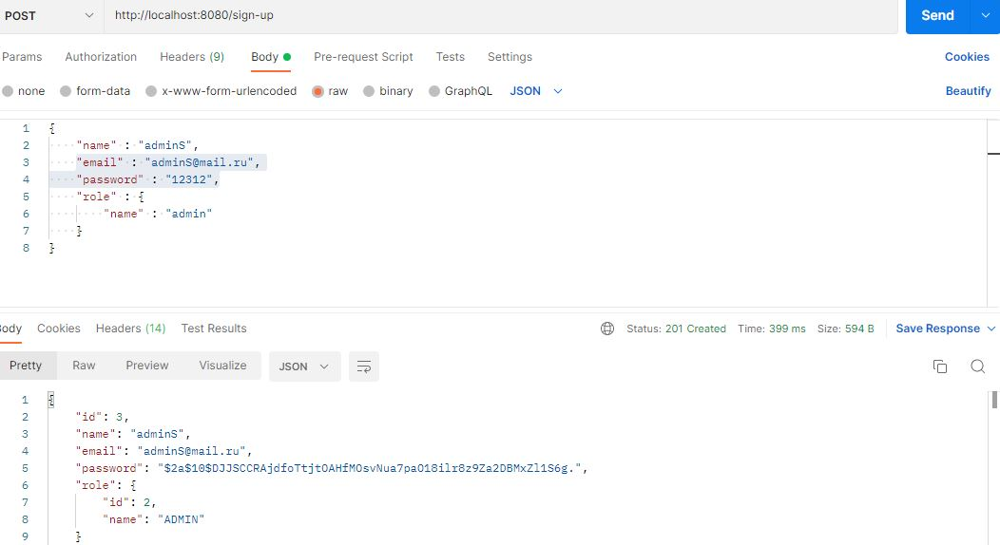

Аутентификация. В заголовке ответа необходимо скопировать токен

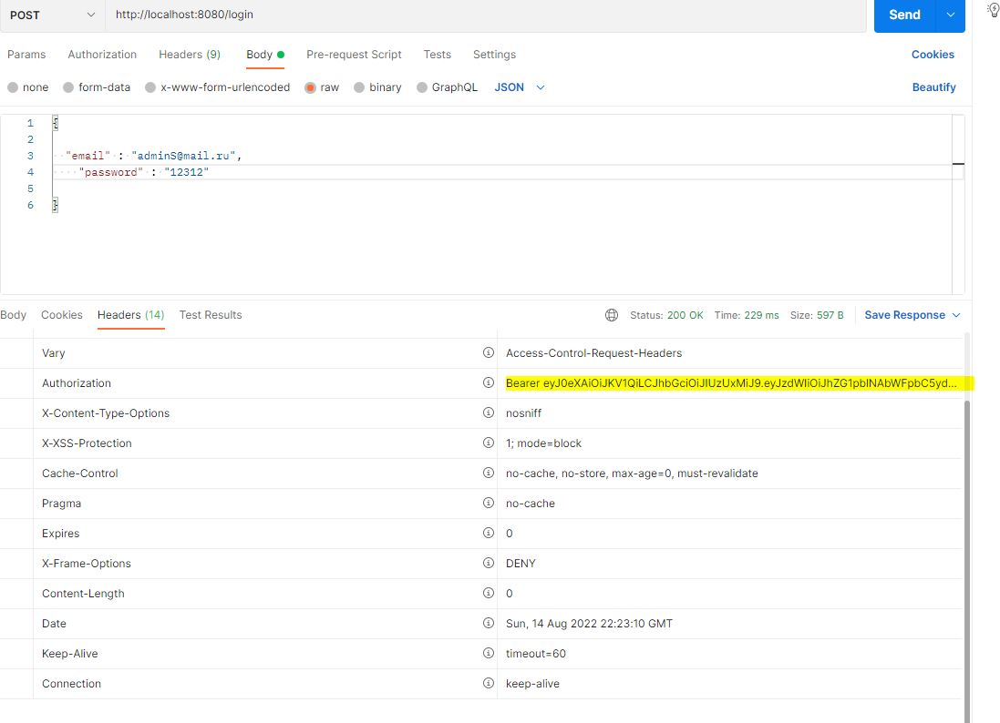

Вставляем скопируемый токен в заголовок Authorization

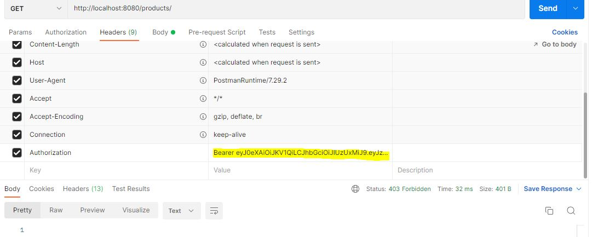

Список всех продуктов

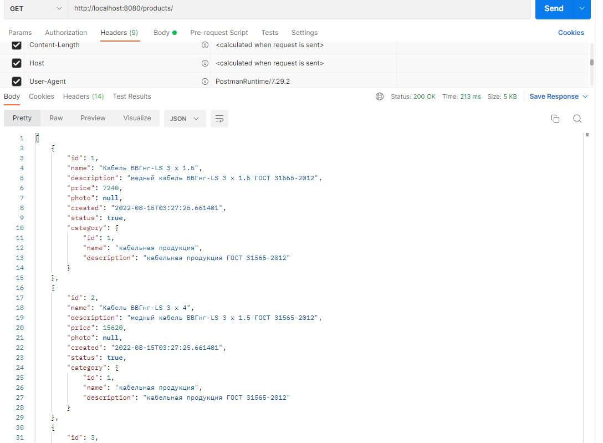

Список всех категорий

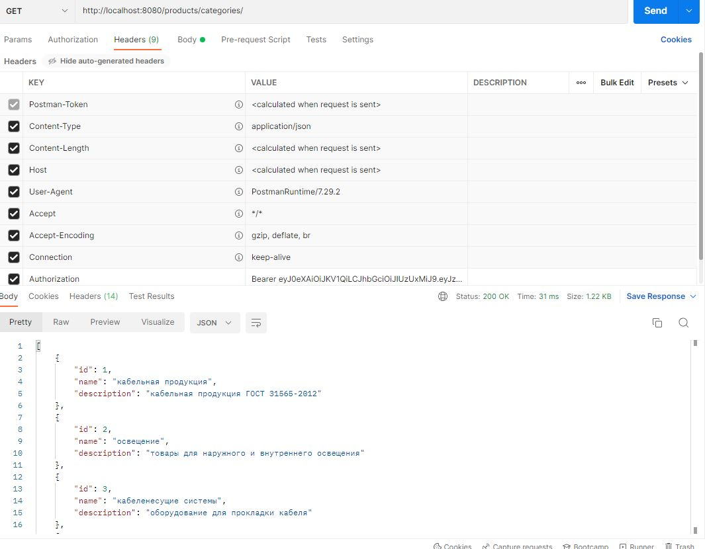

Поиск продуктов по категории

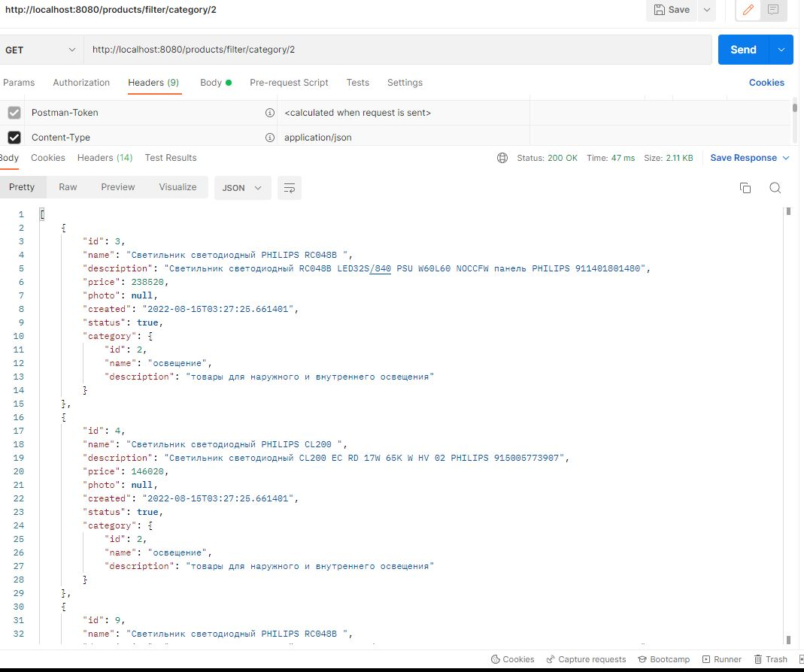

Поиск продуктов по имени

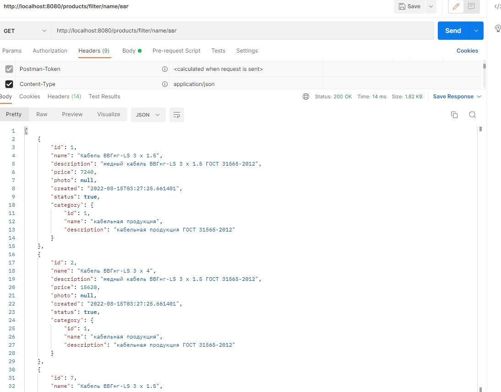

Поиск продуктов по диапазону цен

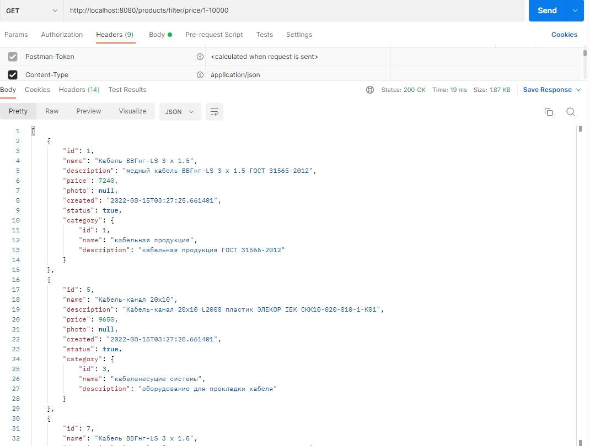

Удалить категорию. Все продукты без категории имеют статус НЕАКТИВЕН

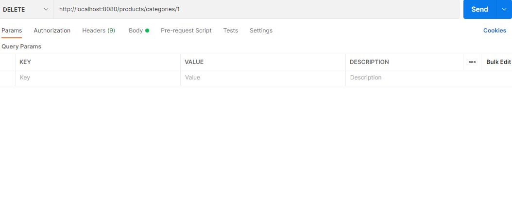

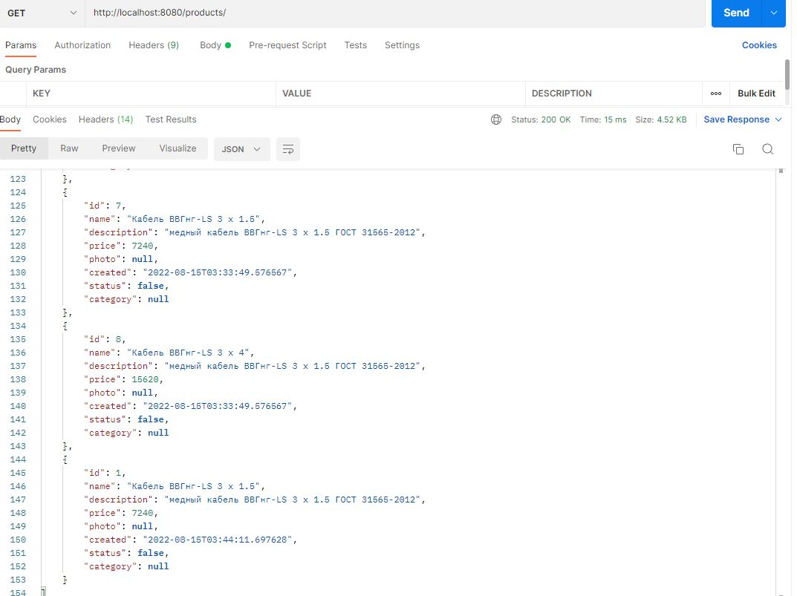

Нельзя присвоить продукту несуществующую категорию

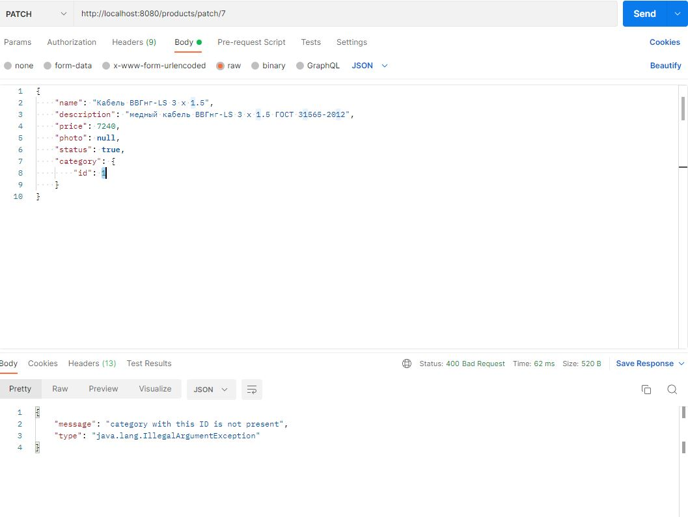

При назначении категории продукту его статус становится АКТИВЕН

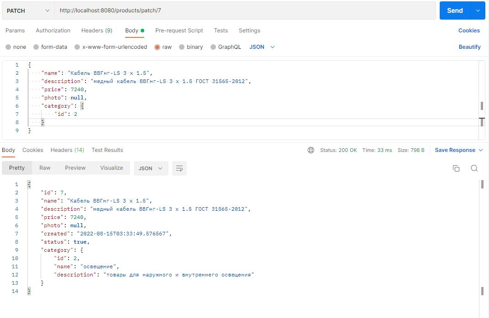

